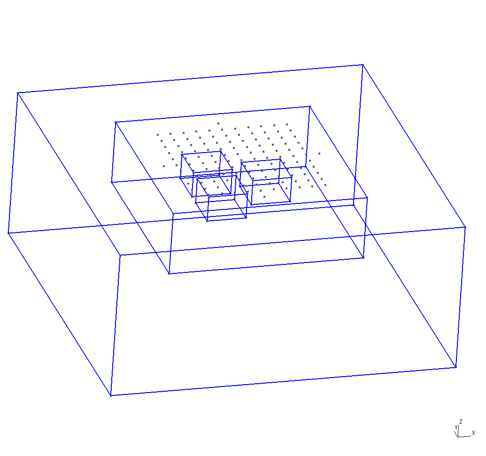
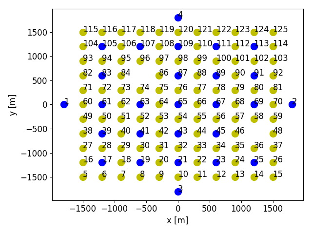
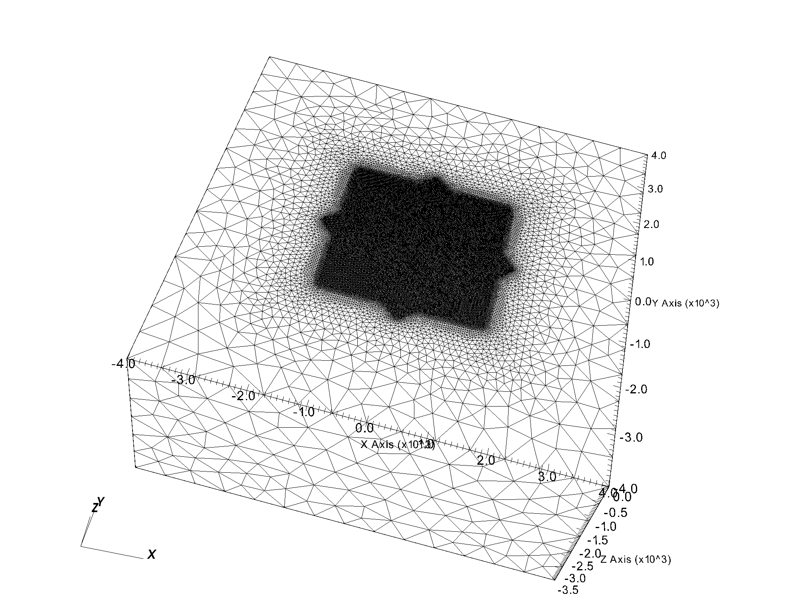

# Synthetic Field Intensity Inversion (aka [FullWaver](http://www.iris-instruments.com/v-fullwaver.html))

This is synthetic case with three cubic anomalies where
one cube defines anomalies in conductivity and charageability,
one cube defines an anomaliy in conductivity and
one cube defines an anomaliy in charageability. The doamin is defines in the gmsh file `domain.geo` which can be visualized in  [gmsh](https://gmsh.info/): 

    cd examples/SuntheticFW
    gmsh domain.geo    
    
and show this geometry setup:

    

The core part shows the three anomalies and the position of charging electrodes and recording stations. In the core region a finer mesh is used while
in the padding region which is added to eliminate boundary effects a coarser mesh is used. We will create a synthetic data set containing 
electric field intensity and (modified) chargeability [Missing reference](XX). 

The first step is to extract the location of the charging electrodes and recording stations from the 'domain.geo' to create the file of station locations 'stations.csv' as defined in the configuration file [`config.py`](config.py) and to generate a schedule file 'synth_schedule.csv'  (again the name is defined in the configuration file) which will later be used to run the virtual survey: 

    ./mkSchedule.py -d 10 domain.geo config

In the survey the electrodes at an offset in the East, North, West and South are paired with in this case 10 (specified by the option `-d 10`) randomly choosen other electrodes setting in this case 4 x 10 charging experiments. The station spacing is recorded as about 300 (if you have not changed the geometry file). 

The lacation of the stations and electrodes can be plotted to the file `station_positions.png` uisng  

    plotStations.py -i station_positions.png config

where green and blue dots refer to recording stations and charging electrode respectively:     

    

A 3D mesh is generated from `domain.geo` using gmsh with the mesh written to `synth.msh` in the GMSH file format (Make sure that the format 2.2 is used):

    gmsh -3 -o synth.msh domain.geo
    
Notice the the cubic anomlies are tagged with "Anomaly1", "Anomaly2" and "Anomaly3". The core region excluding the anomalies is tagged "InnerBox"
while the padding is the tagged "OuterBox". The mesh will have about 135000 nodes. The resolution can be changed by editing `domain.geo`.

The gmsh file ' synth.msh' is converted into an [esys-escript](https://github.com/esys-escript/esys-escript.github.io) mesh file mainly for reasons of performance when reading the mesh under MPI: 

    gmsh2fly.py --silo mesh synth.msh config

The output file name in the `fly` format is specifeid in the configuration file [`config.py`](config.py). The converter also generates the file `mesh.silo` to visualize the mesh:  

    

Notice that the the converter includes the stations and electrodes into the `fly` file as point elements.

Now we can create synthetic survey data:

    runSynthetic.py -n 5 config

In this case the columns electric field intensity 'E' and modified chargeability 'GAMMA' as secified by the `datacolumns` variable in the 
configuration file are calculatated for the survey defined by 'synth_schedule.csv'. A new file 'synth_data.csv' is created. It defines the in put for the inversion.

by @LutzGross
