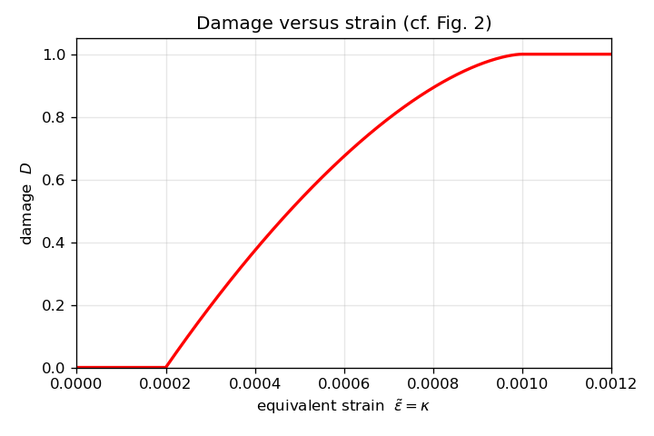
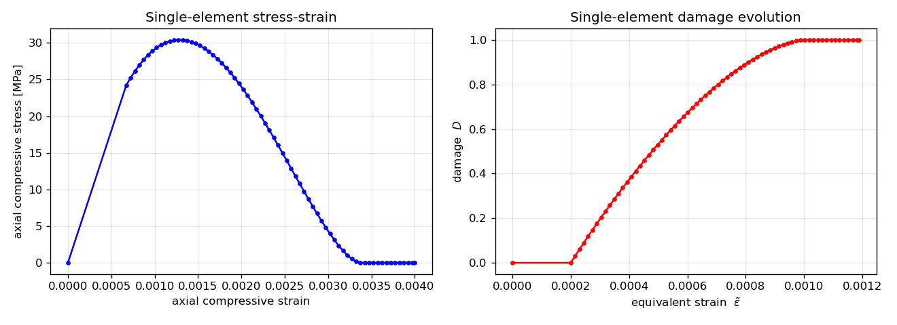
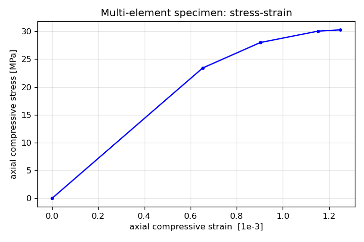
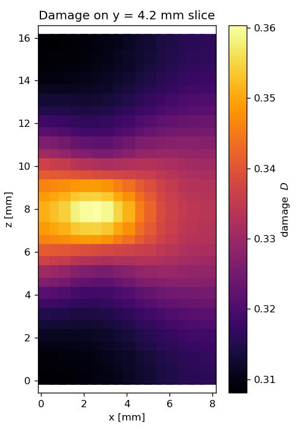
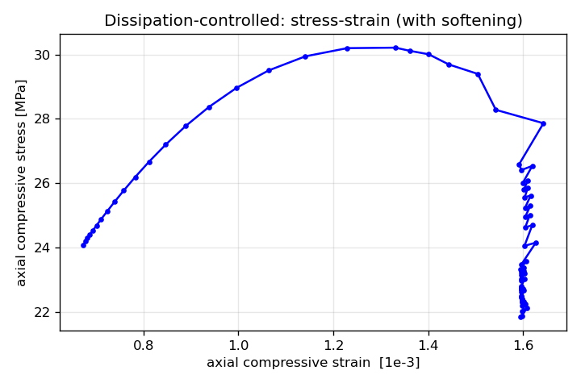
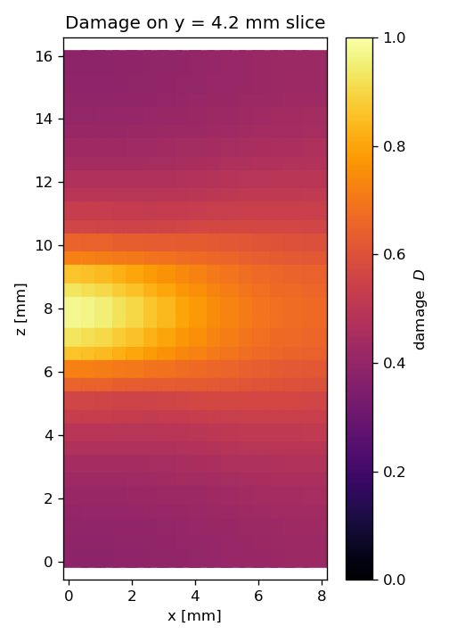

# Smoothed Continuum Damage Model — Single-Element Test

This example exercises the `SmoothDamageModel` (`fingal.damage`, the smoothed
continuum damage model of Mondal, Olsen-Kettle & Gross, *Computers and
Geotechnics* **122** (2020) 103505) on a single finite element before it is used
on real meshes.

The driver [`test1.py`](./test1.py) performs two checks:

1. **Constitutive check** — the damage law `D(kappa)` (Eq. 8) is evaluated over
   `[kappa0, kappa_c]` and plotted (cf. Fig. 2 of the paper).
2. **FEM check** — a single tri-linear hexahedral element is loaded in
   displacement-controlled uniaxial compression with free lateral faces (minimal
   corner pins allow Poisson expansion). A staggered scheme updates the damage
   and re-solves equilibrium, producing the axial stress–strain and
   damage–strain response.

On a single element the non-local Helmholtz smoothing is the identity (uniform
field, Neumann boundary), so this exercises the full local model and the
damage/elasticity coupling.

### Run

    PYTHONPATH=../../bin run-escript test1.py

Outputs:

- `damage_vs_strain.png` — the constitutive damage curve.
- `single_element_response.png` — stress–strain and damage evolution.

The run also prints the per-step response and, at the end, the peak stress and
final damage (≈ 30.4 MPa and `D = 1.0` for the shipped parameters).

The constitutive damage law `D(kappa)` (cf. Fig. 2 of the paper):

The single-element uniaxial-compression response (note the elastic branch runs
to the origin while the first solved point sits at damage onset, `kappa0`):

### Loading and adaptive step-size control

The loading path is driven by `model.runLoading(set_bc, nsteps, ...)`. It is
parameterised by a **load factor** in `[0, 1]` with nominal increment
`1/nsteps`; the load level at factor `f` is prescribed through
`set_bc(pde, f*nsteps, nsteps)`, so at the nominal factors `k/nsteps` this is
just the plain `set_bc(pde, k, nsteps)` that the example defines. Because
`set_bc` is also evaluated at intermediate factors, it must accept a *fractional*
`step` argument — the standard `u_bc * step / nsteps` form (used in
[`test1.py`](./test1.py)) does.

Each (sub-)step calls `solveLoadStep`, which runs the staggered
equilibrium/damage iteration to the tolerance `tol` (default `1e-6`) with at most
`max_iter` iterations (default `20`).

`runLoading` accepts the following step-control options:

| Option | Default | Meaning |
| --- | --- | --- |
| `nsteps` | — | number of nominal load increments (nominal increment `1/nsteps`). |
| `tol` | `1e-6` | convergence tolerance on the damage change per staggered iteration. |
| `max_iter` | `20` | maximum staggered iterations per (sub-)step. |
| `adaptive` | `True` | enable automatic bisection sub-stepping (see below). |
| `min_increment` | `1e-3/nsteps` | smallest allowed load-factor increment; reaching it without convergence terminates the run. |
| `scale_to_onset` | `True` | scale the first step elastically to the damage-onset load factor (see below). |

**Adaptive bisection (`adaptive=True`, the default).** When a (sub-)step does not
converge within `max_iter` staggered iterations, the committed state
(`self.u`, `self.stress`, `self.kappa`, `self.D`) is rolled back, the load
increment is **halved** and the (sub-)step is retried. After a successful step
the increment is grown back toward the nominal `1/nsteps`. If a (sub-)step still
does not converge once the increment has been reduced to `min_increment`, the
calculation is **terminated** with a `RuntimeError` (rather than silently
accepting an unconverged step). Bisection relies on the incremental-residual
formulation of `solveLoadStep`, which carries the stress state between steps.

Rollback requires that only the load level changes between (sub-)steps, so
`set_bc` must be a pure function of the load factor (no external state).

**Fixed schedule (`adaptive=False`).** The classic fixed `nsteps` schedule is
used with no sub-stepping; a non-converged step is committed anyway and
`solveLoadStep` logs a warning. This reproduces the original behaviour.

**First step scaled to onset (`scale_to_onset=True`, the default).** Below the
damage threshold the response is linear elastic and the equivalent strain is
homogeneous of degree one in the load factor, so a single elastic solve at full
load gives the load factor `s = kappa0 / max(ebar)` at which the peak non-local
equivalent strain first reaches `kappa0` (damage onset). The first committed step
jumps directly to this scaled elastic state, skipping the purely-elastic
sub-steps and saving the corresponding equilibrium solves (it is only applied
when starting from the undamaged state). The onset step is reported with zero
staggered iterations. Because the elastic ramp below onset is no longer sampled,
[`test1.py`](./test1.py) seeds its history with the `(0, 0)` origin so the
stress–strain plot still shows the elastic branch.

Examples:

    # default: adaptive on, terminates if it cannot converge at 1e-3/nsteps
    model.runLoading(set_bc, nsteps=80, callback=record)

    # allow finer sub-stepping before giving up
    model.runLoading(set_bc, nsteps=80, callback=record, min_increment=1e-6)

    # disable adaptivity (fixed 80-step schedule, warn on non-convergence)
    model.runLoading(set_bc, nsteps=80, callback=record, adaptive=False)

    # do not skip the elastic ramp (resolve every elastic sub-step)
    model.runLoading(set_bc, nsteps=80, callback=record, scale_to_onset=False)

Progress and step-control messages (bisection, non-convergence, termination) are
emitted through the `fingal.SmoothDamageModel` logger; enable them with

    import logging
    logging.basicConfig(level=logging.INFO)

The convergence flag and final damage change of the most recent step are also
available as `model.converged` and `model.last_change`.

## Multi-element specimen — `test2.py`

[`test2.py`](./test2.py) takes the model to a real mesh: a `8 × 8 × 16 = 1024`
hexahedral prism (element size `h = l/2`, i.e. two elements per localisation
length `l`, the paper's minimum to resolve the smoothing) loaded in
displacement-controlled uniaxial compression with smooth platens. A small
**weaker flaw** is placed off-centre — a sphere with slightly reduced stiffness
`E0` (the Lamé parameters are scaled by `0.8`; `nu` and the damage threshold
`kappa0` are unchanged). It is *not* pre-damaged: under load the softer flaw
strains more, reaches the equivalent-strain threshold `kappa0` first, and so
nucleates damage that **localises** there instead of smearing uniformly. This
exercises what the single element cannot: the non-local Helmholtz smoothing
(identity on one element), the incremental-residual equilibrium solve, and the
adaptive load stepping.

Run:

    PYTHONPATH=../../bin run-escript test2.py

Outputs:

- `multi_element_response.png` — volume-averaged axial stress–strain response.
- `multi_element_damage_slice.png` — damage on the mid-plane (`y = Ly/2`) slice
  (colour range autoscaled), showing the concentration at the flaw and its
  non-local halo.
- `multi_element_damage.silo` and per-step `multi_element_step0NN.silo` — damage,
  displacement and axial stress fields for VisIt / ParaView.

The driver loads only up to the peak of the response, so the localisation is
still **mild**: damage concentrates at the flaw and forms an incipient band
across mid-height, but the variation is small (the whole specimen is near the
threshold at the peak). A sharp, fully-developed band only forms on the
**post-peak softening branch**, which under displacement control is numerically
stiff (snap-back): the staggered scheme stops converging and the adaptive
bisection sub-steps down toward `min_increment`, making little progress (watch
the `INFO` bisection messages). Traversing the softening branch robustly needs
arc-length / load-factor-as-unknown control — this is what `test3.py` does.

## Post-peak softening — `test3.py` (dissipation-controlled)

[`test3.py`](./test3.py) drives the same weaker-flaw prism with
`SmoothDamageModel.runLoadingDissipation`, which makes the load factor `lambda`
an **unknown** (the Dirichlet load is `r = lambda * r_ref`) and controls each
step by prescribing the **incremental dissipation** `Δτ = ∫ Y (D − Dₙ) dV`
(with `Y = ½ ε:C₀:ε` the damage energy-release rate). Because dissipation only
increases (2nd law), it is a monotone path parameter even where `lambda`
decreases — so the softening branch that `test2.py` stalls on can be followed.

Each staggered corrector solves the residual correction `du_I` (`r = 0`) and the
load sensitivity `du_II` (`r = r_ref`, `X = 0`) with the current secant
stiffness, then a scalar solve picks `dλ` so the total dissipation hits `Δτ`;
the damage is updated in the loop. On non-convergence `Δτ` is halved and the
step retried (down to a floor, below which it raises). Loading starts undamaged:
the first step scales elastically past onset to seed a non-zero dissipation.

Run:

    PYTHONPATH=../../bin run-escript test3.py

Outputs `m3_response.png` (the **full stress–strain curve including the
descending, near-vertical softening branch**), `m3_damage_slice.png` (a
fully-developed localisation band, `D → 1`), and per-step `m3_step0NN.silo`.

The method carries the solution from the ~30 MPa peak down the softening branch
to near-complete failure of the band (`D_max ≈ 0.99`), where displacement
control could not go. Note the tangent is still the SPD **secant** stiffness, so
close to `D = 1` (vanishing band stiffness) the corrector needs `Δτ` cut-backs;
a consistent-tangent monolithic Newton would be the fully-robust — but much
larger — alternative.
