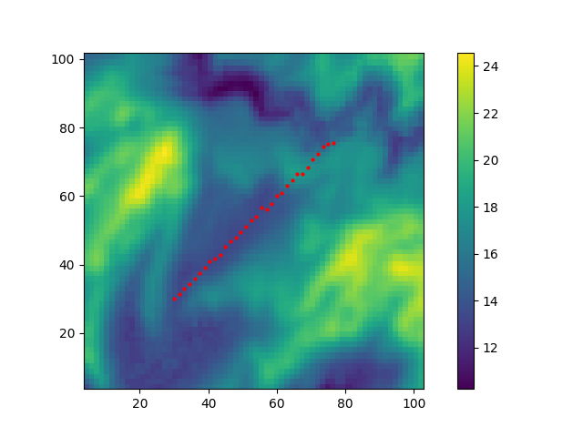
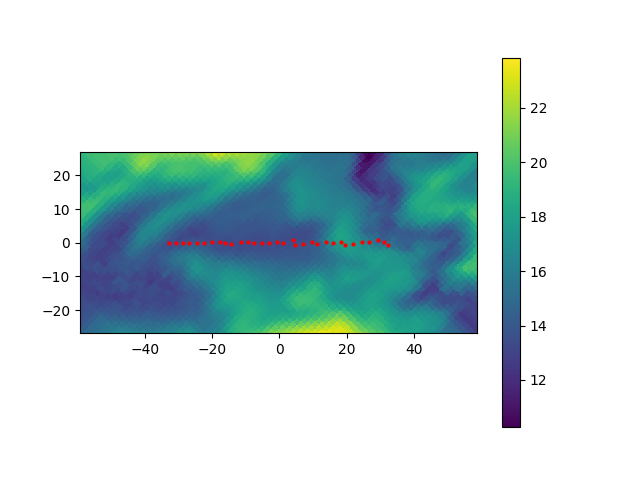

# ERT/IP with Topography

This example allows for a topography. `makeMesh` is used to generate the mesh using `gmsh`. The final 3D mesh is generated
from deforming a flat surface mesh according an interpolation table. It is assumed that the interpolation table covers the 
surface of core region around the survey area defined by the given electrodes. Appropriate extrapolation (at lower resolution) 
is used for the surface region outside the given interpolation data.   

## Data
The position of the electrodes are given in `electrodes_in.csv`. Format is `i, x, y` or `i, x, y, z` where is `i` is the electrode 
identifier. Survey design is given in `schedule.csv`. Format is `A, B, M, N` for charging `A-B` and measurement `M-N`. 

Topography is defined via an interpolation table:
#### Via a Grid
Elevation is given via a grid where `elev[j,i]` is the elevation value at position `(x[j], y[i])` as `numpy` data file:  

    assert eval.shape == (y.shape[0], x.shape[0])
    numpy.savez("elevation_grid", x=x, y=y, elevation=elev)

Extrapolation via nearest neighbour values is used if values outside the interpolation region is requested.

#### Via a cloud
Elevations can also be given as cloud data
where `elev[i]` is the elevation value at position `(x[i], y[i])` as

    X, Y= np.meshgrid(x,y, indexing='ij')
    np.savez("elevation_cloud", x=X.flat, y=Y.flat, elevation=elev.flat)

## Plotting

Plot the topography and electrode locations over the core region to file `setup.png`:

    makeMesh.py --topo elevation_grid.npz --recenter --plot outline.png  electrodes_in.csv

`--recenter` moves the center of the survey area center and rotates it to better align with the 
axes to minimise meshing volume. 

Original survey in global coordinates:

    

Survey in local coordinates:

    

## Mesh generation (all in)

Generate the mesh by running 

    makeMesh.py --topo elevation_grid.npz  --recenter --fly domain.fly --new_station_file electrodes.csv  --plot outline.png  electrodes_in.csv

This creates `fly` mesh file and a new station file with added or updated 
elevations as z-coordinates. Notice, that plotting and mesh generation can not be completed
in the same run. This will also generate some intermediate `gmsh` mesh and geo files with names 
typically starting with `tmp`. 

## Meshing - step-by-step

YOu can pass through the mesh generation step-by-step. For instance, option `-1` will create  a geometry file with a flat surface name `tmp_2D_flat.geo`
which can be checked loading it into `gmsh`:

    makeMesh.py -1 --topo elevation_grid.npz  --recenter --fly domain.fly --new_station_file electrodes.csv  --plot outline.png  electrodes_in.csv

Available steps are:

- `-1`: make flat surface geometry file `tmp_2D_flat.geo; then stop.
- `-2`: make flat surface mesh file `tmp_2D_flat.msh; then stop.
- `-3`: apply topography to surface `tmp_2D.msh; then stop.
- `-4`: generate 3D geometry with topography `tmp.geo; then stop.
- `-5`: generate 3D mesh file `tmp.msh; then stop.
- `-6`: generate fly file; requires  a fly-file name to be set.

If no set is specified all steps are executed.

