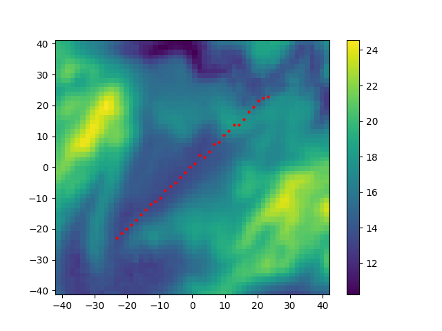

# ERT/IP with Topography

This example allows for a topography. `makeMesh` is used to generate the mesh using `gmsh`. The final 3D mesh is generated
from deforming a flat surface mesh according an interpolation table. It is assumed that the interpolation table covers the 
surface of core region around the survey area defined by the given electrodes. Appropriate extrapolation (at lower resolution) 
is used for the surface region outside the given interpolation data.   

## Data
The position of the electrodes are given in `electrodes_in.csv`. Format is `i, x, y` or `i, x, y, z` where is `i` is the electrode 
identifier. Survey design is given in `schedule.csv`. Format is `A, B, M, N` for charging `A-B` and measurement `M-N`. 

Topography is defined via an interpolation table:
#### Via a Grid
Elevation is given via a grid where `elev[j,i]` is the elevation value at position `(x[j], y[i])` as `numpy` data file:  

    assert eval.shape == (y.shape[0], x.shape[0])
    numpy.savez("elevation_grid", x=x, y=y, elevation=elev)

Extrapolation via nearest naighbour values is used if values outside the interpolation region is requested.

#### Via a cloud
TBA

## Plotting

Plot the topography and electrode locations over the core region to file `setup.png`:

    makeMesh.py --topo elevation_grid.npz --recenter --plot setup.png  electrodes_in.csv

`--recenter` moves the center of the survey area to the origin `(0,0)`.

    

### 