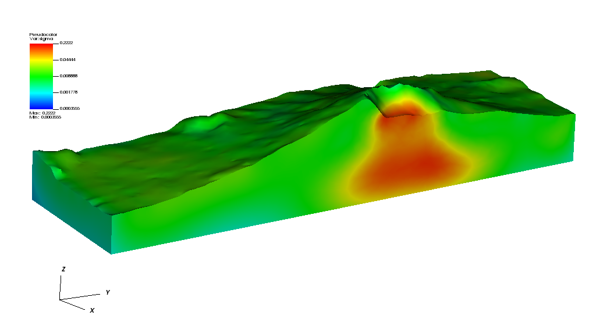

# Volcano: Electric Field Intensity Inversion (aka [FullWaver](http://www.iris-instruments.com/v-fullwaver.html))

This is an expample for inverting IP data for a geometry with topography. The (still synthetic) data are collected using the FullWaver approach using the intensity of the electric field and the projection of the secondary electric field incerement to the primary electric field as data. 
 

    cd examples/VolvanoFW
    
The `config.py` file is the configuration file. A plot `loc.png` of the stations can be generated:

    plotStations.py config
    

    

Symthetic data are generated by running: 

    runSynthetic.py --fullwaver --silo geo --noise 5 config

It is using the survye schedule `FWSchedule.csv` to generate FullWaver style survey data on file `Data.csv` - both set in thje configuration file `config.py`.
A 5 pc. nose is added to the data. The mesh and the true electric conductivity are wriiten to file `geo.silo` using the silo file format: 

    
    

color shows the valiue of the true condictivity. The mesh is refined in the area where stations are located: 

    

To run the inversion use

     runIPFieldinversion.py --sigmaOnly -d config

which is creating a `sigma.silo`: 

    

    runIPFieldinversion.py --restart -d config

by @LutzGross
